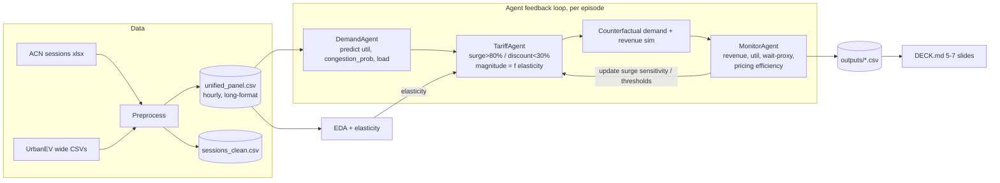

# Agentic AI Dynamic Tariff Optimization for EV Charging Networks

**Target:** Society of Business — Open Project 2026 submission. Deliverables: reproducible notebooks + CSV outputs + 5–7 slide deck content. **Deadline: today (7 June 2026).**

All file paths below are relative to the project root (`socbiz openproj/`).

---

## Summary

Build a self-improving dynamic-pricing engine for EV charging, framed as three cooperating Python agents (Demand → Tariff → Monitor) wired in a feedback loop. Train demand forecasting on a unified time-slot panel merged from both official datasets, translate forecasts into surge/discount tariffs calibrated by price elasticity, and prove the loop improves revenue + utilization + wait-time KPIs over evaluation episodes against a ₹15/kWh flat baseline.

The decisive analytical asset is **UrbanEV**: it carries real observed prices that *vary over time* plus a `dynamic_pricing` flag (57 dynamic grids vs 190 static). That gives a genuine price–demand signal to estimate elasticity and a natural dynamic-vs-static comparison — the backbone of every pricing claim. ACN supplies session-level behavior (durations, idle time, arrival patterns) that grid panels can't show.

---

## Problem Frame

Flat ₹/kWh tariffs ignore operational dynamics: peak congestion, off-peak idle chargers, rising procurement cost, poor UX. The task is to predict demand, set tariffs that maximize revenue while smoothing congestion, and continuously learn from outcomes — without overclaiming causality.

**Scope of this plan:** the full analytics pipeline (preprocess → EDA → demand model → tariff agent → monitor loop), the CSV result artifacts, and the deck content. It does **not** include a live API, RL training infrastructure, or an LLM-driven agent runtime — those are out of scope for a one-day deliverable and add risk without scoring extra metric points.

---

## Datasets (verified by direct inspection)

| Dataset | Grain | Coverage | Key columns | Pricing? |
|---|---|---|---|---|
| **ACN** (`Datasets OP_26 Analytics/ACN Data_.../acndata_sessions.json.xlsx`) | 1 row / session | 16,304 sessions, 25 Apr–16 Dec 2018, Caltech + JPL | `connectionTime`, `disconnectTime`, `doneChargingTime`, `kWhDelivered`, `stationID`, `spaceID`, `siteID`, `userID`, `kWhRequested`, `minutesAvailable` | No |
| **UrbanEV** (`Datasets OP_26 Analytics/UrbanEV_ SZ_districts/`) | 5-min slot × grid | 8,640 slots (19 Jun–18 Jul 2022), 247 grids, Shenzhen | `occupancy.csv`, `volume.csv`, `duration.csv`, `price.csv` (all timestamp × 247 grids), `information.csv` (per-grid: `count`, `fast_count`, `slow_count`, `area`, `lon/la`, `CBD`, `dynamic_pricing`), `adj.csv`/`distance.csv` (spatial graph), `time.csv` (calendar) | **Yes — observed, time-varying** |

**Critical data facts baked into the plan:**
- ACN times are GMT strings (`"Wed, 25 Apr 2018 11:08:04 GMT"`) — parse with timezone, convert to `America/Los_Angeles` (column present) for correct hour-of-day.
- UrbanEV wide matrices share an integer row index (1..8640) that maps to `time.csv` rows → real timestamps. Reshape wide → long before merging.
- UrbanEV `price` ≈ 0.5–1.4 (¥/kWh). ACN has no price. The unified base will carry `price_per_kwh` nullable, populated only for UrbanEV.
- `dynamic_pricing` ∈ {0,1} per grid → the dynamic-vs-static cohort split.

---

## Key Technical Decisions

1. **One unified dataframe, common time-slot grain (per brief's "align by timestamp, station ID, session granularity").** ACN sessions are resampled into hourly station occupancy/energy; UrbanEV is aggregated 5-min → hourly per grid. Both stack into a single long-format dataframe (`outputs/unified_panel.csv`) sharing one schema, tagged by `source` ∈ {acn, urbanev} and `region`. It's genuinely one dataset — you just slice by `source` to use each for what it's good at (UrbanEV rows carry prices and drive all elasticity/tariff work; ACN rows drive session behavior). Standard practice, nothing to caveat.
2. **Utilization rate = occupancy / pile_count** (UrbanEV has `count` per grid) and = busy-station-hours / available-station-hours (ACN). One formula per source, documented. This is the spine: surge/discount thresholds (>80% / <30%) key off it.
3. **Demand model: gradient boosting (LightGBM; fallback sklearn `HistGradientBoostingRegressor`) + a seasonal-naive baseline.** Tabular + strong temporal/lag features beat heavier models on this size and are reproducible in minutes. Report against the naive baseline so R²/RMSE gains are interpretable.
4. **Tariff = multiplier on a flat baseline.** Headline scenario uses the brief's **₹15/kWh** flat baseline; results also reported in native units. Surge when forecast util > 80%, discount when < 30%, magnitude bounded and **calibrated by estimated price elasticity** rather than guessed.
5. **Elasticity estimated from UrbanEV** (the only priced data): regress Δlog(volume) on Δlog(price) with grid + hour fixed effects, restricted to dynamic-pricing grids. Treated as an association, not a causal claim (brief requires this caution). It sets how aggressively the Tariff Agent moves price.
6. **Counterfactual revenue is simulated, not observed.** New-tariff demand = observed demand × elasticity response to the price change. Revenue gain %, off-peak uplift, and wait-time reduction are simulation outputs with assumptions stated on-slide.
7. **Agents are Python classes in `src/agents/`, imported by notebooks.** Narrative lives in notebooks; logic is testable and reused across the feedback loop. The "learning" is a transparent online parameter update (surge sensitivity / threshold) driven by Monitor KPIs across episodes — simple, inspectable, demonstrably improving.

---

## High-Level Technical Design



The loop runs over held-out time episodes (e.g., rolling days of the test window). Each episode: forecast → price → simulate response → score → nudge Tariff params. MonitorAgent logs per-episode KPIs so the deck can show the curve trending up.

---

## Output Structure

```
socbiz openproj/
├── notebooks/
│   ├── 01_preprocess.ipynb
│   ├── 02_eda.ipynb
│   ├── 03_demand_model.ipynb
│   ├── 04_tariff_agent.ipynb
│   └── 05_monitor_eval.ipynb
├── src/
│   ├── data.py            # loaders, time parsing, unified-base builder
│   ├── features.py        # feature engineering, utilization formulas
│   ├── elasticity.py      # UrbanEV elasticity estimation
│   └── agents/
│       ├── demand.py      # DemandAgent
│       ├── tariff.py      # TariffAgent
│       └── monitor.py     # MonitorAgent + feedback loop runner
├── outputs/               # all CSV deliverables
├── tests/                 # lightweight sanity tests
├── DECK.md                # 5-7 slide content
└── requirements.txt
```

The per-unit `Files` lists are authoritative; this tree is the intended shape.

---

## Implementation Units

### U1. Preprocessing & Unified Analytical Base

**Goal:** Produce two clean, documented artifacts — a session table (ACN) and a unified hourly panel (ACN + UrbanEV) — with engineered economic features.

**Requirements:** Data Preprocessing (align by timestamp/station/grain; engineer utilization, revenue/session, energy cost/kWh, queue proxy, occupancy density; documented missing-value handling).

**Dependencies:** none.

**Files:** `src/data.py`, `src/features.py`, `notebooks/01_preprocess.ipynb`, `outputs/unified_panel.csv`, `outputs/sessions_clean.csv`, `requirements.txt`, `tests/test_features.py`

**Approach:**
- ACN: load xlsx (`openpyxl`), parse GMT timestamps → tz-aware → LA local. Derive `session_duration_hr`, `charging_duration_hr` (done − connect), `idle_hr` (disconnect − done), `kwh`, station/site IDs. Resample to **hourly station occupancy** (a station is "busy" in hour h if a session overlaps h) → ACN rows of the unified panel.
- UrbanEV: reshape `occupancy/volume/duration/price` wide → long (timestamp × grid). Join `information.csv` metadata (`count`, `fast_count`, `slow_count`, `CBD`, `dynamic_pricing`, `area`). Aggregate 5-min → hourly (occupancy = mean, volume = sum, price = mean). Compute `utilization = occupancy / count` clipped [0,1].
- Unified panel columns: `timestamp, source, region, location_id, hour, dow, is_weekend, energy_kwh, occupancy, capacity, utilization, price_per_kwh (nullable), queue_proxy (max(0, demand−capacity)), is_cbd, is_dynamic_pricing`.
- Missing values: document each rule in a markdown cell + a `missing_value_log` dict (e.g., forward-fill short UrbanEV gaps ≤2 slots; drop sessions with `kWhDelivered`≤0 or end<start; flag, never silently impute prices).

**Patterns to follow:** EAFP parsing, module-level helpers, type hints (user style).

**Test scenarios:**
- Utilization formula returns 0.5 for occupancy=5, capacity=10; clips >1 to 1.0.
- ACN session spanning 11:08–13:20 marks hours 11,12,13 busy for its station.
- Negative/zero `kWhDelivered` and end<start rows are dropped (count asserted).
- Unified panel has no NaN in `utilization`; `price_per_kwh` NaN only where `source=='acn'`.
- Wide→long reshape preserves total volume (sum before == sum after).

**Verification:** Both CSVs written; row counts and the missing-value log printed in the notebook; sanity tests pass.

---

### U2. Exploratory Data Analysis

**Goal:** Insight-driven, pricing-relevant EDA: temporal cycles, peak/shoulder/off-peak volatility, dynamic-vs-static comparison, spatial/CBD patterns, and the observed price–demand relationship.

**Requirements:** EDA (intraday/weekday-weekend profiles, volatility across peak periods, fleet vs public signatures, all visuals tied to pricing implications).

**Dependencies:** U1.

**Files:** `notebooks/02_eda.ipynb`, `outputs/eda_summary.csv`

**Approach:**
- Intraday + weekday/weekend utilization curves (both sources); label peak / shoulder / off-peak windows and quantify volatility (std, coef. of variation) per window.
- **Dynamic-vs-static cohort:** compare utilization smoothness, peak-to-trough ratio, and price dispersion between `dynamic_pricing` 1 vs 0 grids → motivates the whole project.
- Observed price vs volume scatter/binned curve (UrbanEV) → visual precursor to elasticity.
- ACN: session duration & idle-time distributions, arrivals by hour (workplace signature), per-site differences (Caltech vs JPL).
- CBD vs non-CBD utilization; brief spatial note using grid metadata.
- Every figure: titled, axis-labeled, with a one-line "pricing implication" caption.

**Test scenarios:** `Test expectation: none — exploratory notebook.` (Reuses U1-tested helpers; assert only that `eda_summary.csv` is non-empty.)

**Verification:** Notebook runs top-to-bottom; ≥6 labeled figures; peak/off-peak windows and the dynamic-vs-static contrast quantified in `eda_summary.csv`.

---

### U3. Demand Prediction Agent

**Goal:** Forecast utilization / charging load per location-hour; expose `congestion_probability`. Hit RMSE/MAE/R².

**Requirements:** Demand Prediction Agent (predicted utilization rate, congestion probability, expected load). Metrics: RMSE, MAE, R².

**Dependencies:** U1.

**Files:** `src/agents/demand.py`, `notebooks/03_demand_model.ipynb`, `outputs/demand_metrics.csv`, `outputs/demand_predictions.csv`, `tests/test_demand.py`

**Approach:**
- Features: `hour`, `dow`, `is_weekend`, cyclical encodings, lag features (util at t−1h, t−24h), rolling mean/std (3h, 24h), grid metadata (`capacity`, `fast/slow` share, `is_cbd`, `is_dynamic_pricing`), `region/source`.
- **Temporal split** (no leakage): train on first ~70% of the time window, validate ~15%, test ~15%. Per-source models (ACN and UrbanEV have different scales) or a single model with `source` feature — pick whichever scores better on val; document choice.
- Models: seasonal-naive baseline (predict same hour-of-day mean) + LightGBM (fallback `HistGradientBoostingRegressor`).
- `DemandAgent.predict(X)` → `utilization_pred`, `expected_load_kwh`, `congestion_probability` (calibrated P(util > 0.8), e.g., from a second classifier or quantile of residuals).
- Report RMSE/MAE/R² per source on test set, baseline vs model, in `demand_metrics.csv`.

**Patterns to follow:** sklearn-style `.fit/.predict`; type hints; no leakage.

**Test scenarios:**
- Temporal split: max(train timestamp) < min(test timestamp) — asserted.
- `DemandAgent.predict` returns finite values; `congestion_probability` ∈ [0,1].
- Model beats seasonal-naive baseline on val RMSE (assert improvement, else fail loudly).
- Feature matrix has no target leakage (target column absent from features).

**Verification:** `demand_metrics.csv` shows model RMSE/MAE and R² beating baseline; predictions CSV written.

---

### U4. Price Elasticity Estimation

**Goal:** Estimate demand response to price from UrbanEV — the calibration input for tariff magnitude. Stated as association, not causation.

**Requirements:** underpins Tariff Pricing Agent (revenue/off-peak realism) and the "Customer Response Rate" elasticity proxy.

**Dependencies:** U1.

**Files:** `src/elasticity.py`, `outputs/elasticity.csv` (folded into `notebooks/04_tariff_agent.ipynb`)

**Approach:**
- Restrict to `dynamic_pricing==1` grids (where price actually varies).
- Estimate elasticity ε from Δlog(volume) on Δlog(price) with grid + hour-of-day fixed effects (OLS); also a simple overall ε for the deck.
- Sanity-bound ε to a plausible negative range (e.g., [−1.5, −0.1]); if the estimate is noisy/positive, fall back to a documented assumed ε and flag it.
- Output ε (overall + by peak/off-peak) to `elasticity.csv`.

**Test scenarios:**
- Synthetic data with known ε recovers it within tolerance.
- Estimator drops non-dynamic grids before fitting.
- Returned ε is finite and within the sanity bound (else flagged-fallback path taken).

**Verification:** `elasticity.csv` written with ε values + sample size + R² of the fit; caveat text drafted for the deck.

---

### U5. Tariff Pricing Agent

**Goal:** Translate forecasts into dynamic tariffs (surge >80%, discount <30%), simulate the counterfactual, and report Revenue Gain %, utilization change, off-peak uplift vs the ₹15/kWh flat baseline.

**Requirements:** Tariff Pricing Agent (surge/discount logic). Metrics: Revenue Gain %, Charger Utilization Rate before/after, Off-Peak Uplift.

**Dependencies:** U3, U4.

**Files:** `src/agents/tariff.py`, `notebooks/04_tariff_agent.ipynb`, `outputs/tariff_decisions.csv`, `outputs/revenue_comparison.csv`

**Approach:**
- `TariffAgent.decide(forecast)` → tariff multiplier: util>0.8 → surge (multiplier >1, capped e.g. 1.5×); util<0.3 → discount (<1, floored e.g. 0.7×); linear/stepwise in between. Magnitude scaled by `surge_sensitivity` param (tuned by Monitor in U6).
- Counterfactual: new_demand = base_demand × (new_price/base_price)^ε. Revenue = price × demand (using kWh). Compare dynamic-tariff revenue vs ₹15/kWh flat baseline revenue over the test window.
- Off-peak uplift: % increase in sessions/energy in util<0.3 slots after discount.
- Utilization before/after from the simulated demand shift (demand moves from surged peak slots toward discounted off-peak — quantify peak shaving).
- Write per-decision rows (`tariff_decisions.csv`) and aggregate KPIs (`revenue_comparison.csv`).

**Patterns to follow:** pure decision function (no side effects) for testability; params injected.

**Test scenarios:**
- util=0.9 → multiplier >1 (surge); util=0.2 → multiplier <1 (discount); util=0.5 → ≈1.
- Multiplier respects cap/floor bounds at extreme inputs.
- Revenue Gain % computed correctly on a hand-checked toy example (known prices/demands/ε).
- Off-peak uplift is non-negative when a discount is applied to low-util slots.
- With ε=0, demand is unchanged and revenue gain comes only from price change (guards the sim formula).

**Verification:** `revenue_comparison.csv` shows Revenue Gain % vs ₹15 baseline, utilization before/after, off-peak uplift; decisions CSV written.

---

### U6. Monitoring & Learning Agent + Feedback Loop

**Goal:** Evaluate each pricing decision against operational KPIs over episodes and feed results back to improve Tariff params — demonstrating the self-improving loop.

**Requirements:** Monitoring & Learning Agent. Metrics: Average Waiting Time Reduction, Customer Response Rate, Pricing Efficiency Score (revenue per kWh over time).

**Dependencies:** U5.

**Files:** `src/agents/monitor.py`, `notebooks/05_monitor_eval.ipynb`, `outputs/monitor_episodes.csv`, `outputs/final_kpis.csv`

**Approach:**
- `MonitorAgent.evaluate(decisions, outcomes)` → per-episode KPIs: revenue, achieved utilization, **wait-time proxy** (reduction in queue_proxy = peak overload after demand smoothing), **customer response rate** (Δsessions per Δprice = realized elasticity proxy), **pricing efficiency** (revenue per kWh delivered).
- Feedback loop runner: split test window into episodes (e.g., per day). Each episode → DemandAgent.predict → TariffAgent.decide → simulate → MonitorAgent.evaluate → **update** `surge_sensitivity`/thresholds via a simple rule (e.g., if revenue↑ and wait-proxy↓, push sensitivity further; else revert — bounded step). Log the trajectory.
- Show KPI curves trending up across episodes → the "learning" evidence.
- `final_kpis.csv` consolidates all eval-metric headline numbers for the deck.

**Patterns to follow:** try/finally for any resource cleanup; transparent, inspectable update rule (no opaque optimizer).

**Test scenarios:**
- Wait-time proxy decreases when demand is smoothed (synthetic peak → off-peak shift).
- Pricing efficiency = revenue/kWh computed correctly on toy input.
- Feedback update moves `surge_sensitivity` in the rewarded direction and respects bounds.
- Loop is deterministic given a fixed seed (reproducibility).
- Episode KPIs are monotonically logged (one row per episode).

**Verification:** `monitor_episodes.csv` shows per-episode KPIs with an improving trend; `final_kpis.csv` has all brief metrics in one place.

---

### U7. Deck Content + Final Assembly

**Goal:** 5–7 slide content (excluding cover/exec-summary/appendix) mapping directly to the brief's required slides, plus a reproducibility README cell and an appendix of robustness checks.

**Requirements:** Presentation Deck (data landscape & preprocessing; EDA findings; demand modeling & results; tariff logic & outcomes; monitor evaluation & feedback; business/operational/policy implications; supporting visuals; appendix robustness). Notes: avoid causal claims, state assumptions/limitations.

**Dependencies:** U2, U3, U5, U6.

**Files:** `DECK.md`, `outputs/` (final figures referenced)

**Approach:**
- One section per required slide, each pulling concrete numbers from the `outputs/*.csv` artifacts and naming the supporting figure.
- Slide on assumptions & limitations: elasticity is associational not causal; cross-network merge is schema-level; simulation-based revenue; UrbanEV vs ACN regional/temporal differences.
- Appendix: sensitivity of Revenue Gain % to ε; dynamic-vs-static robustness; per-source model performance.
- Reproducibility: `requirements.txt` + a "run order" note (01→05).

**Test scenarios:** `Test expectation: none — content artifact.`

**Verification:** `DECK.md` has 5–7 core slides each backed by a CSV number + figure; assumptions/limitations slide present; run order documented.

---

## Requirements Traceability

| Brief requirement | Unit(s) |
|---|---|
| Preprocessing / unified base / features / missing-value handling | U1 |
| EDA (temporal, volatility, fleet vs public, pricing-tied visuals) | U2 |
| Demand Prediction Agent (util, congestion prob, load) + RMSE/MAE/R² | U3 |
| Price response calibration (elasticity) | U4 |
| Tariff Pricing Agent (surge/discount) + Revenue Gain %, util before/after, off-peak uplift | U5 |
| Monitoring & Learning Agent + wait-time reduction, customer response rate, pricing efficiency | U6 |
| Deck, assumptions/limitations, no causal overclaim | U7 |
| Reproducible code + CSV outputs | U1–U7 (all write to `outputs/`) |

---

## Risks & Mitigations

- **Cross-network merge looks like apples-to-oranges to judges.** → Frame explicitly as schema-level unification; keep `source` separable everywhere; all pricing claims UrbanEV-only. (KTD 1)
- **Elasticity estimate noisy/wrong sign.** → Sanity-bound + documented fallback ε; report the fit's R²/n; treat as association. (U4)
- **Revenue gain is simulated, not observed.** → State assumptions on-slide; show sensitivity to ε in appendix. (U5, U7)
- **Time leakage inflates demand model.** → Strict temporal split, lag features only from the past, asserted in tests. (U3)
- **One-day time budget.** → LightGBM/tabular not deep learning; rule-based+elasticity tariff not RL; agents are simple classes. Sequence U1→U2/U3 in parallel-friendly order; U7 last.
- **ACN xlsx parse cost (16k rows).** → `openpyxl read_only`; cache cleaned CSV after first load.

---

## Assumptions

- ₹15/kWh is the flat-baseline scenario for Revenue Gain %; native-unit results also reported (UrbanEV prices treated as ¥/kWh, ACN as energy-only).
- A grid's `count` is its pile capacity for utilization; UrbanEV occupancy ≤ count after clipping.
- Hourly is the common grain for the unified panel (UrbanEV downsampled, ACN upsampled from sessions).
- Elasticity is constant within peak/off-peak buckets for the simulation.

---

## Deferred to Follow-Up Work

- Live pricing API / real-time serving.
- RL or LLM-driven agents.
- Spatial GNN demand model using `adj.csv`/`distance.csv` (mention as future work in appendix).
- True multi-network causal evaluation.
